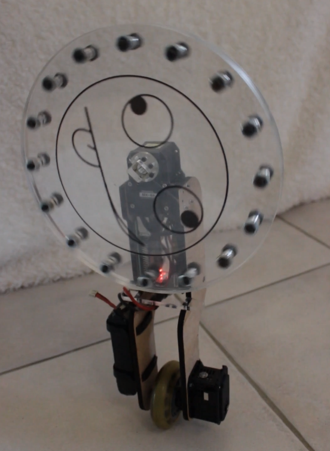

# SUZETTE : Système Unicycle Zélé Et Télécommandé Tourné vers l'Enseignement
Suzette est un gyropode à réaction.
Sa roue motorisée lui permet de se maintenir en équilibre d'avant en arrière, tandis que son volant d'intertie lui permet de rester à la verticale sur le plan latéral.

La commande est de type 'Integral Term Sliding Mode Controller', implémentée en python sur un ordinateur embarqué (RPI4).

